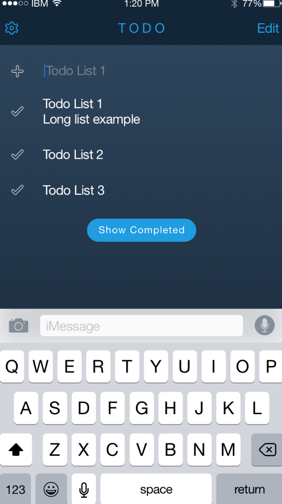
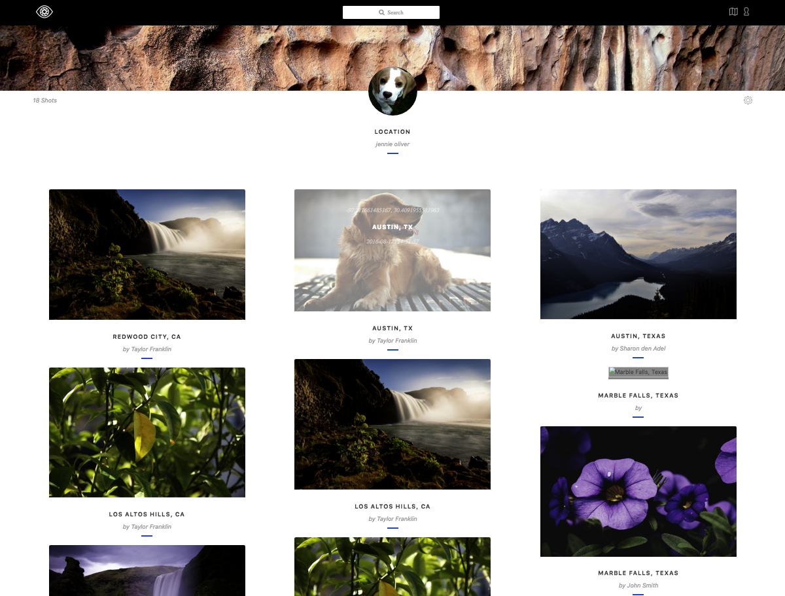

footer: © IBM, 2016
slidenumbers: true

# **Blitter**
## Building a Social networking backend in Swift 3

---


---

# Steps

- Set up up project and dependencies
- Set up routes
- Add Facebook authentication
- Set up the model and database 
- Handle the requests

---

# Steps

- **Set up up project and dependencies**
- Set up routes
- Add Facebook authentication
- Set up the model and database 
- Handle the requests

---

## Create the **boilerplate**
 
```bash
$ ~/> mkdir Blitter && cd Blitter
$ ~/Blitter/> swift package init
```

--- 

## Create the **boilerplate**
 
```bash
$ ~/Blitter/> swift package init


Creating library package: Blitter
Creating Package.swift
Creating .gitignore
Creating Sources/
Creating Sources/Blitter.swift
Creating Tests/
Creating Tests/LinuxMain.swift
Creating Tests/BlitterTests/
Creating Tests/BlitterTests/BlitterTests.swift
```

---

## If you want to develop in **XCode**

```bash
$ ~/Blitter/> swift package generate-xcodeproj
$ ~/Blitter/> open Blitter.xcodeproj
```

---


---

# Add dependencies

```swift
// Package.swift
import PackageDescription

let package = Package(
    name: "TwitterClone",
    dependencies: [
        .Package(url: "https://github.com/IBM-Swift/Kassandra",       majorVersion: 0,  minor: 1),
        .Package(url: "https://github.com/IBM-Swift/Kitura.git",      majorVersion: 0,  minor: 27),
        .Package(url: "https://github.com/IBM-Swift/SwiftyJSON.git",  majorVersion: 0,  minor: 13)
        ]
)
```

---

# Steps

- Set up up project and dependencies
- **Set up routes**
- Add Facebook authentication
- Set up the model and database 
- Handle the requests


---

# Basic Routing

```swift
router.get("/") { request, response, next throws in

  // Get my Feed here
  
}

router.get("/:user") { request, response, next throws in

  // Get user bleets here
  let user = request.parameters["user"]
  
}

router.post("/") { request, response, next throws in

   // Add a Bleet here.

}
```

---

# Make a controller

```swift
public class BlitterController {
    
    let kassandra = Kassandra()
    public let router = Router()
    
    public init() {
        router.get("/", handler: getMyFeed)
        router.get("/:user", handler: getUserFeed)
        router.post("/", handler: bleet)
        router.put("/:user", handler: followAuthor)
    }
}
```

---
# Steps

- Set up up project and dependencies
- Set up routes
- **Add Facebook authentication**
- Set up the model and database 
- Handle the requests

---

# Adding Credentials middleware:
```swift
import Credentials
import CredentialsFacebook

let credentials = Credentials()
credentials.register(CredentialsFacebook())


```

--- 

# Using the Credentials middleware

```swift

router.post("/", middleware: credentials)

router.post("/") { request, response, next in 
   /// ...
   let profile  = request.userProfile
   let userId   = profile.id            // "robert.dickerson"
   let userName = profile.displayName   // "Robert F. Dickerson"
   /// ...
}

```
---
# Steps

- Set up up project and dependencies
- Set up routes
- Add Facebook authentication
- **Set up the model and database**
- Handle the requests

---

# Bleet Model

```swift
struct Bleet {
    
    var id          : UUID?
    let author      : String
    let subscriber  : String
    let message     : String
    let postDate    : Date
    
}

```

--- 

## String value pairs

```swift
typealias StringValuePair = [String : Any]

protocol StringValuePairConvertible {
    var stringValuePairs: StringValuePair {get}
}

```

---

## Make it work for collections too

```swift
extension Array where Element : StringValuePairConvertible {
    var stringValuePairs: [StringValuePair] {
        return self.map { $0.stringValuePairs }
    }
}
```

---

## Bleet String value pairs

```swift
extension Bleet: StringValuePairConvertible {
    var stringValuePairs: StringValuePair {
        var result = StringValuePair()
        
        result["id"]          = "\(self.id!)"
        result["author"]      = self.author
        result["subscriber"]  = self.subscriber
        result["message"]     = self.message
        result["postdate"]    = "\(self.postDate)"

        return result
    }
}
```
---

## Add **Model** behavior

```swift
import Kassandra

extension Bleet : Model {
  static let tableName = "bleet"
  
  // other mapping goes here
}
```

---

## Save the Bleet

```swift

let bleet = Bleet(id         : UUID(),
                  author     : "Robert",
                  subscriber : "Chris"
                  message    : "I love Swift!",
                  postDate   : Date()
                  )

try kassandra.connect(with: "blitter") { _ in
    bleet.save()
}

```

---

# Save a Bleet for each follower

```swift
// Get the subscribers ["Chris", "Ashley", "Emily"]
let newbleets: [Bleet] = subscribers.map {
       return Bleet( id:          UUID(),
                     author:      userID,
                     subscriber:  $0,
                     message:     message,
                     postDate:    Date())
}
                
newbleets.forEach { $0.save() { _ in } }
```

---

## Asynchrononous Error Handling

```swift

func doSomething(oncompletion: (Stuff?, Error?) -> Void) {

}
```

---

## Asynchrononous Error Handling :+1:

```swift
enum Result<T> {
    case success(T)
    case error(Error)
    
    var value: T? {
        switch self {
        case .success (let value): return value
        case .error: return nil
        }
    }
    
    // Do same for error
}
```

---

## Get the list of Bleets

```swift

func getBleets(oncomplete: (Result<[Bleet]>) -> Void) {
  try kassandra.connect(with: "blitter") { _ in
    Post.fetch() { bleets, error in 
     
       if let error = error  {
          oncomplete( .error(error) )
       }
       
       let result = bleets.flatMap() { Bleet.init(withValuePair:) }
       oncomplete( .success(result) )
    }

  }
}
```


---

## Get Bleets written by a user

```swift
Bleet.fetch(predicate: "author" == user, 
            limit: 50) { bleets, error in 

   /// 
            
}
```

___

# Steps

- Set up up project and dependencies
- Set up routes
- Add Facebook authentication
- Set up the model and database 
- **Handle the requests**


---

## Get back Blitter feed


```swift


getBleets { result in
            
    guard let bleets = result.value else {
        response.status(.badRequest).send()
        response.next()
        return
    }
                
    response.status(.OK)
        .send(json: JSON(bleets.stringValuePairs))
        response.next()
    }
}

```

---

## Get JSON from the request

```swift

extension RouterRequest {
    
    var json: Result<JSON> {
        
        guard let body = self.body else {
            return .error(requestError("No body in the message"))
        }
        
        guard case let .json(json) = body else {
            return .error(requestError("Body was not formed as JSON"))
        }
        
        return json
    }
}

```

--- 
## Save the Bleet

```swift
      
let userID = authenticate(request: request)
        
let jsonResult = request.json
guard let json = jsonResult.result else {
    response.status(.badRequest)
    next()
    return
}
        
let message = json["message"].stringValue

// Save the Bleets with author matching userID
```

---

# Play with the code

[https://github.com/IBM-Swift/Blitter](https://github.com/IBM-Swift/Blitter)

--- 
# Todo List [^1]

- TodoList **MongoDB**
- TodoList **CouchDB**
- TodoList **PostgreSQL**
- TodoList **MySQL**
- TodoList **DB2**
- TodoList **SQLite**
- TodoList **Redis**



[^1]: [https://github.com/IBM-Swift/TodoList-Boilerplate](https://github.com/IBM-Swift/TodoList-Boilerplate)

---

# BluePic Web Example[^1]

- CouchDB
- Object Storage
- Watson Vision and Weather
- iOS frontend
- AngularJS frontend



[^1]: [https://github.com/IBM-Swift/TodoList-Boilerplate](https://github.com/IBM-Swift/BluePic)
